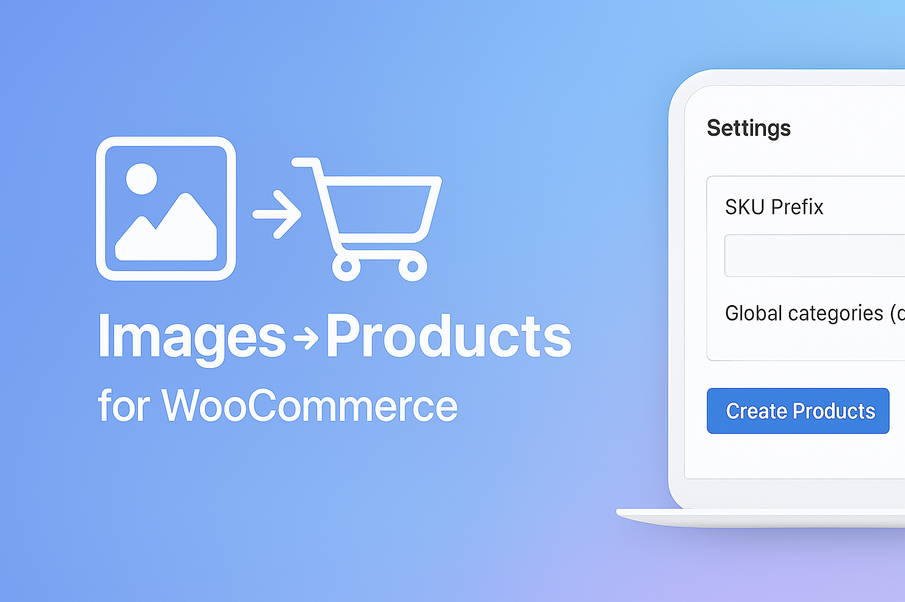
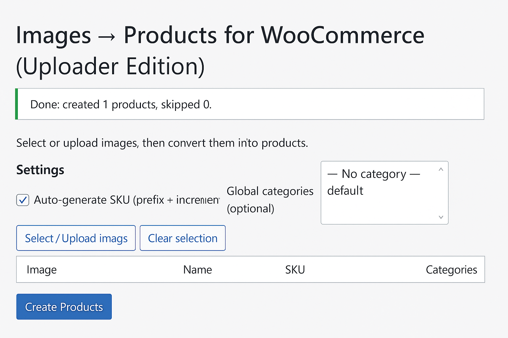
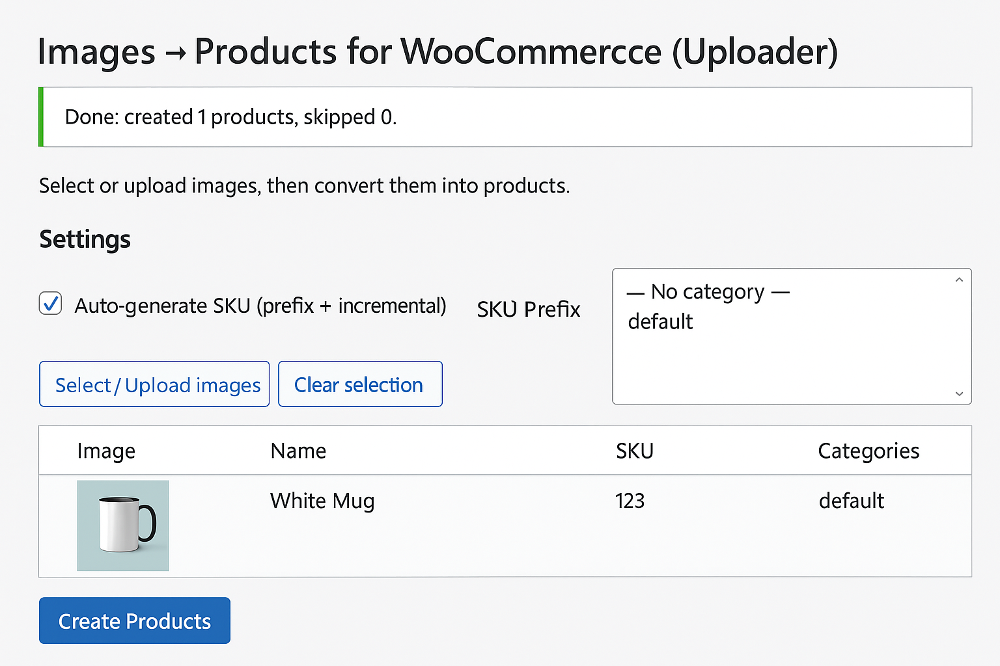

# 🖼️ Images to Products for WooCommerce
### _Bulk‑create WooCommerce products directly from images_

---

## Overview

**Images to Products for WooCommerce (Uploader Edition)** lets you **upload/select multiple images** and instantly create **Simple Products** — each image becomes its own product with the image set as **featured image**.

Perfect for artists, photographers, galleries and anyone who manages many image‑based products.

> ✅ Per‑row fields, auto SKU with prefix, multi‑category selection, duplicate checks, price & description support.

## Features

- Bulk convert images → products
- Auto product name from filename
- Featured image set automatically
- Price & Description per item
- Multi‑select **Categories**
- Auto‑generate **SKU** (prefix + incremental) or custom per item
- Duplicate detection (skip or create with unique title)
- Clean, compact admin UI (WordPress/Woo style)

## Requirements

- WordPress **6.0+**
- WooCommerce **9.x+**
- PHP **7.4+**

## Installation

1. Download a release ZIP (or build your own).
2. In WP Admin → **Plugins → Add New → Upload Plugin**, select the ZIP and **Install Now**.
3. Activate **Images to Products for WooCommerce**.
4. Open **Products → Images → Products (Uploader)**.

## Usage

1. Click **Select / Upload images** and choose multiple images.
2. Optionally set **SKU Prefix** and **Global categories**.
3. For each row, adjust **Name, SKU, Price, Description, Categories**.
4. Click **Create Products**.

### UI

## Changelog

### 2.3.5
- Readme polish, assets update, and small admin UI tweaks.
- i18n cleanup, escaping & sanitization for inputs.
- Replace deprecated `get_page_by_title()` with `WP_Query`.
- Keep stable feature set (Price, Description, Categories, SKU).

### 2.3.4
- Table layout fixes (stable column widths), no visual restyle.

### 2.3.3
- Text domain & headers aligned with WP.org guidelines.

## License
GPLv2 or later — see `LICENSE` or <https://www.gnu.org/licenses/gpl-2.0.html>.
